# Daily Scrum Timer Ball

How to build am easy to use timer ball for time boxed daily scrum meetings.

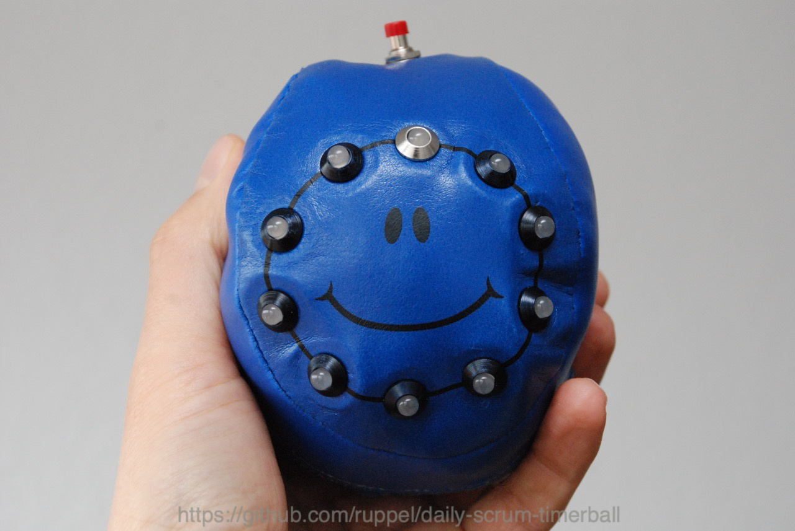

## Introduction

In winter 2015 during a retrospective my team had the big wish to have a timer for the daily scrum meetings. They regularly needed more than 15 minutes for the meeting. This made them very unhappy. So they asked me to organize a timer.

I searched the web and asked the [All-Knowing Trash Heap](http://www.google.com) for help. But it seemed that by now nobody got an easy to use scrum timer for sale. So I decided to build one for my own. In winter time a good decision.

The other thing is, that I continously watched the market of DIY wearables. There are a lot of cool tiny computers in the world which deserve that we create something really usefull out of them. But by now the magazines are full with useless bullshit like an extremely ugly compass.
Requirements

There are a few requirements the Timer Ball should fulfill:

- Be a ball that can be given around without hazzling with cables
- Can be thrown
- One touch handle
  - Only one touch should be needed to start the timer
  - And only one touch should be needed to restart the timer no matter whether the timer is already running or elapsed
- Clear display of the timers progress
- Clear display that the timer elapsed
- Ability to change the time of the timer
  - in minutes from 1 to 10
  - default: 2
- Should be cool

## Solution

My searches in the wearables market brought me to these items:

- Wattuino Nanite 85 (ATtiny85 with USB Bootloader) [Link](https://shop.watterott.com/Wattuino-Nanite-85-ATtiny85-mit-USB-Bootloader)
- WS2812 5mm LED mat [Link](https://shop.watterott.com/WS2812-5mm-LED-matt-10-Stueck)

Explanation:

- The Nanite is small enough to find place in a soft ball (along with the batteries). He needs 3 AA Akkus (I didn't check with alkaline batteries due to environmental reasons). He only has six pins, but that is far enough as you will see.
- The LEDs are also called NeoPixel. They are able to display RGB colors and have a little logic chip inside. This chip enables them to be controlled using a bus. Multiple LEDs only need one output pin from the Nanite and every single LED can have another color.
- So, the Nanite can be programmed, the LEDs can display different colors. The other things needed is a battery holder, an on/off switch, a push button and cables.
- Additionaly you might need holders for the LEDs and shrinking tubes. And depending on the ball or other item you put all these in you need some more material.

## Usage

Now, how do you use that gadget?

1. Switch it on
   - The timer starts and the LEDs get configured by the library while they light in blue.
   - The timer directly goes into the PAUSE mode where the LEDs sequentially turn red.
1. Push the button
   - The timer starts and counts two minutes (showing the elapsed time with a blue LED)
1. If you again push the button, the timer simply restarts.
1. If the timer elapses, all LEDs flash white for half a second and then the timer goes into PAUSE mode (see 2.)

Isn't that really easy?

There is the possibility to configure the timer from 1 minute up to the 10 minutes (according to the fact, that you attached 10 LEDs to the timer):

1. The timer must be switched on of course
1. Press the button for 5 seconds
   - One LED should light up green.
1. Sequentially press the button to configure the timer (first LED green = 1 Minute, 2nd = 2 Minutes,...)
1. To end the config, do not push the button for 10 seconds
   - All LEDs shortly light up green and the timer goes into PAUSE mode.

## Wiring

Wiring is easy. Have a look at the picture.

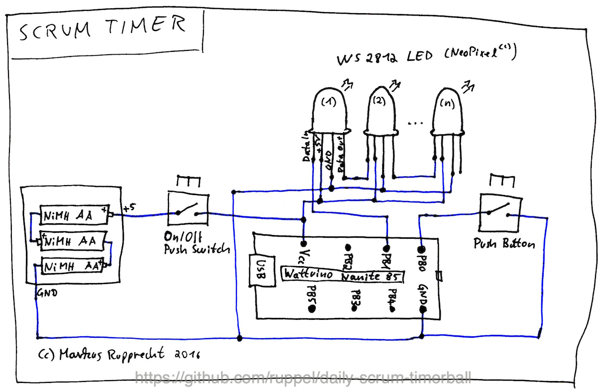

- Note that only the first LED needs three cables from the nanite (GND, +5 and PB1). The other LEDs are connected in a row (+5 to +5, GND to GND, Data out to Data in).
- The on/off switch connects the +5 from the batterie and the Vcc from the nanite. The bush button connects GND to PB0 from the nanite.
- For the concrete assembly I recommend using shrinking tubes, especially for the LEDs as the pins are very close to each other.

## Programming

You can find my code in the file TimerBall.ino.

### Arduino IDE

- You need to install the [Watterott Board Extension](https://learn.watterott.com/arduino/watterott-boards/) to the Arduino IDE.
- You also need to install the [library for the NeoPixels](https://github.com/cpldcpu/light_ws2812) from Adafruit.
- Be sure to have the IDE set to
  - Board: ATtiny85 (16.5 MHz)
  - Core: ATtiny85 (by Spence Konde)
- You are able to programm the arduino directly using a micro usb cable (do not attach it using a USB hub!)

### Explanation to the code

- The first three defines set the hardware configuration. On what pins are the switch and the LEDs attached. And how many LEDs. Note that the code respects any number of LEDs. (while there is a limit by the LEDs themselve)
- The next four defines set the software defaults. Change them to any value you like.
- The other defines are to distinguish the different states of the timer.

- As we want to directly react on the switch, we are not able to programm long light show sequences
- Instead we check the state and update the lights as we need it, and then loop again.
- This makes light show programming a little bit difficult
- The func "showTimerRun" is the main point for the light show, when the timer is running. Of course there could be much nicer shows as the one I did :-)
- The func "showEnd" flashes all LEDs to white and holds this for half a second. This could also be made nicer.
- At last the func "showPause" is the function for the pause animation.

## Attach the thing in the ball

A few years ago my team manager gave us a nice soft ball to "sqeeze out" our frustration :-). It is not filled with some foam but with synthetic wool. So I was able to open it, put out the wool and prepare it as the timer. I searched the internet for such a ball, but I didn't find it. So you need to search by yourself.

The very first thing to do was to attach a zip to the opened ball. Now, ... you should have a sewing machine for this. So the ball can easily be opened to change the batteries or to fix other problems.

The first problem to solve is the attachment of the LEDs. They are standard 5 mm size, so normal LED holders can be used. I took one silver and nine black to mark the first LED. And they should be threaded. It did cost me some nights to think about, how those holders can be attached to the synthetic leather skin of the ball. Then I tried to fix washers with a good glue on the inside of the skin. This gave the thing the needed stability to hold the LED holders, the switch and also the push button.

The second problem is that instead of standard LEDs with two pins, the NeoPixes have 4 pins and the normal LED holders do not hold them. They slip into the ball because the little plastic tube to hold them back cannot be used. By now I have no good solution for this. I attached some poster (chewing gum) glue to a little bit fix them. I searched the internet for hours but I didn't find LED holders for those NeoPixels...

The three AA batteries are in a small box. I did the arduino in a tiny plastic bag and fixed it on the box with duct tape.

If all is in the ball, take some of the synthetic wool and fill the gaps. It should be a ball that can be thrown and that does not crash directly when it falls on the floor.

## Conclusion

My team really likes that ball. They use it in every daily meeting.

We also use it in other moments, e.g. in retrospectives and lean coffee sessions.

## Pictures

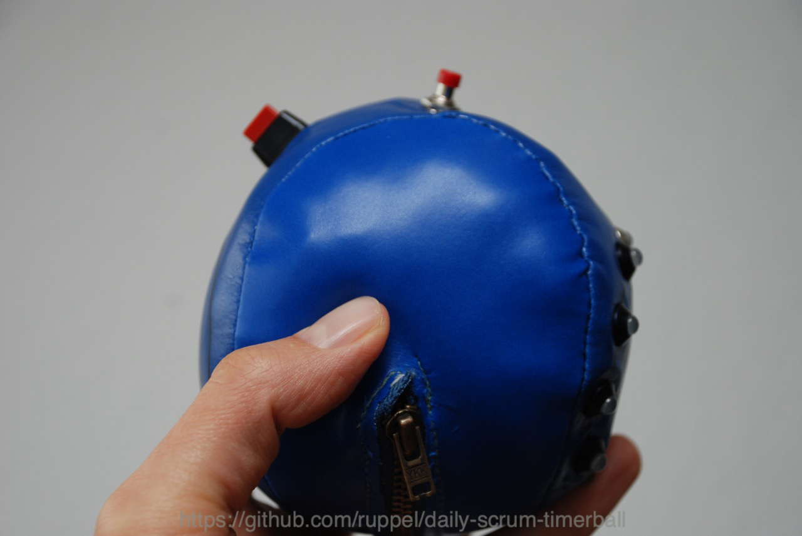
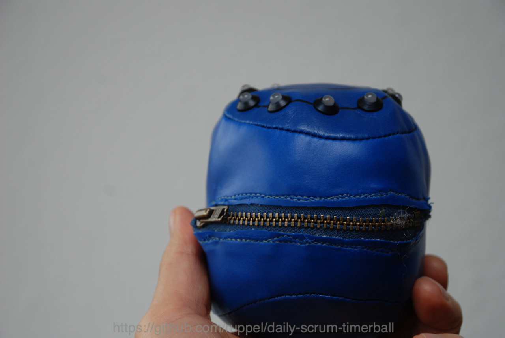
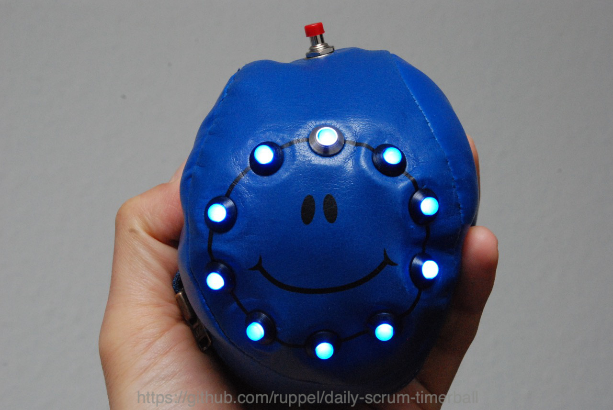
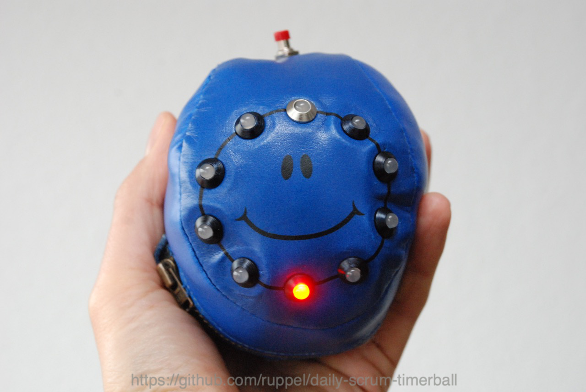
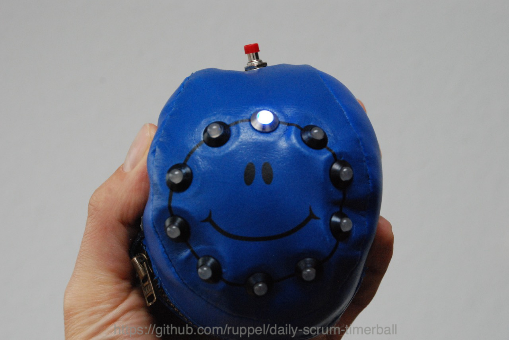
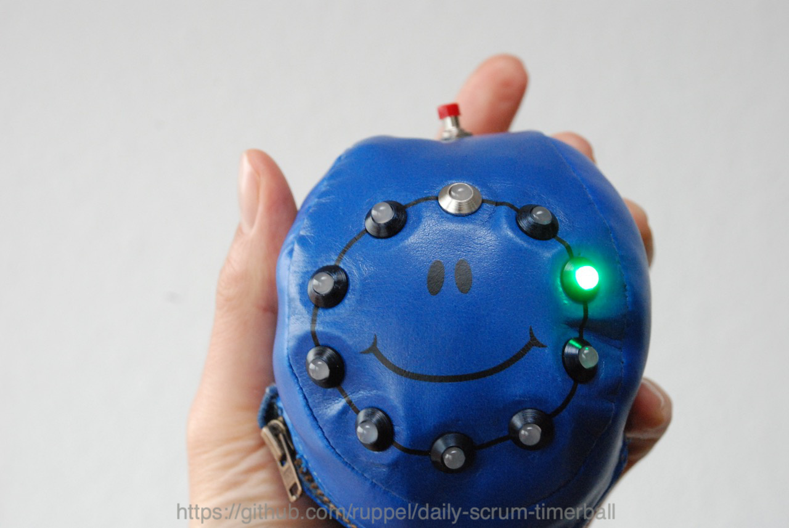
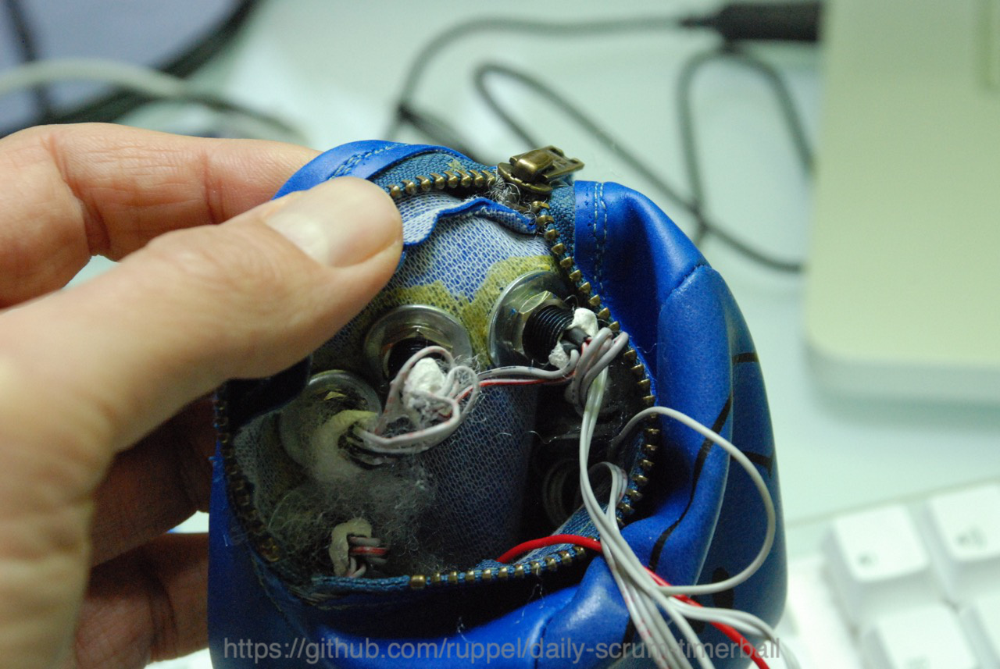
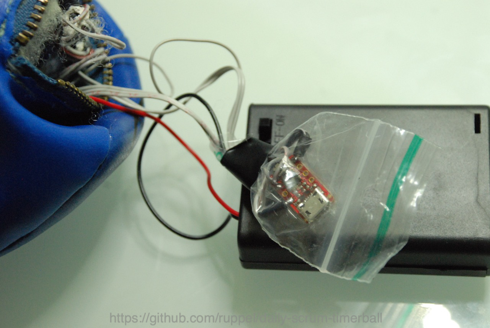
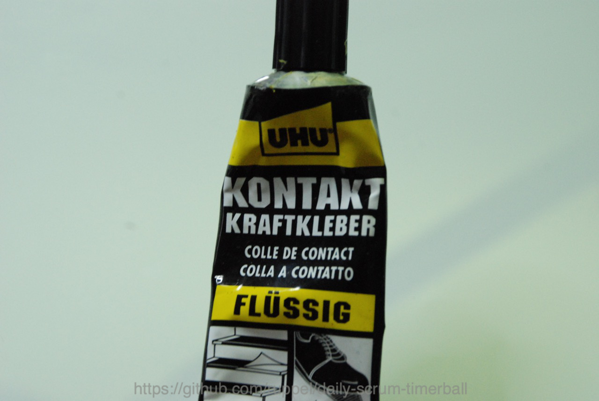
